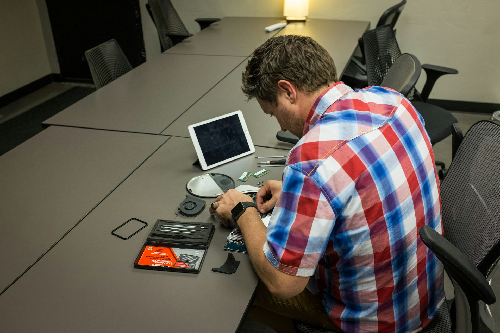

## 🌟 영어 표현 - check on

안녕하세요! 👋 오늘은 영어로 **'점검하다', '확인하다', '살펴보다'** 라는 의미를 나타내는 **"check on"** 표현에 대해 알아볼게요.

"check on"은 일상생활에서 정말 자주 사용되는 표현이에요. **주로 누군가나 무언가의 상태를 확인하거나 살펴볼 때 사용하죠.** 이 표현은 **관심과 배려**를 나타내는 상황에서 특히 유용해요. 🤗

예를 들어, 아픈 친구를 걱정할 때 이렇게 말할 수 있어요. "I'm going to check on my sick friend." (아픈 친구를 살펴볼 거예요.) 여기서 "check on"은 '살펴보다'라는 의미로 사용됐어요. 사람뿐만 아니라 물건이나 상황을 확인할 때도 자연스럽게 쓸 수 있답니다!

"check on"은 또 다른 뉘앙스로도 쓰여요. **진행 상황을 확인**할 때도 사용할 수 있죠. 🕵️‍♀️ 예를 들면, "I need to check on the progress of the project." (프로젝트 진행 상황을 확인해야 해요.) 이렇게 말하면 일의 진행 정도를 살펴본다는 뜻이 됩니다.

## 🤔 'check' vs 'check out' vs 'check on'

"check", "check out", 그리고 "check on"은 모두 비슷한 의미를 가지고 있지만, 사용되는 상황에 따라 약간의 차이가 있어요. 각각의 표현이 어떻게 다른지 살펴볼까요? 🤔

1. **check**: 가장 기본적인 표현으로, 단순히 무언가를 확인할 때 사용해요. 예를 들어, "I need to check my email." (이메일을 확인해야 해요.)처럼 사용할 수 있죠.

2. [**check out**](/blog/in-english/104check-out/): 주로 무언가를 **살펴보거나 경험**해보는 의미로 사용돼요. 예를 들어, "You should check out that new restaurant." (그 새 식당에 가봐야 해요.)처럼, 새로운 것을 추천할 때 자주 쓰여요.

3. **check on**: 누군가의 **상태나 상황을 확인**할 때 사용해요. 예를 들어, "I'll check on my friend to see how she's doing." (내 친구가 어떻게 지내는지 확인할게요.)처럼, **관심과 배려**를 나타내는 표현이에요. 💖

이렇게 세 가지 표현은 비슷하지만, 각각의 뉘앙스와 사용되는 상황이 다르니 잘 기억해두세요! 😊

## 📖 예문

"아기가 잘 자고 있는지 확인해볼게요."

"I'll check on the baby to see if she's sleeping well."

"저녁 식사가 잘 되고 있는지 확인해볼게요."

"I'm going to check on dinner to see how it's coming along."

자, 이제 "check on"을 사용한 다양한 예문을 살펴볼까요? 꼭 소리내어 말하면서 연습해보세요! 🚀

## 💬 연습해보기

자기 전에 아이들 좀 볼게.

I'll check on the kids before I <a href="/blog/in-english/240.go-to-bed/">go to bed</a>.

오늘 나중에 할머니 상태를 확인해 볼 거야. 요즘 좀 몸이 안 좋으시거든.

I'm gonna check on Grandma later today. She's been feeling <a href="/blog/in-english/099.under-the-weather/">under the weather</a>.

오븐에 있는 치킨 좀 봐줄래?

Hey, could you check on the chicken in the oven?

내가 없는 동안 화분 확인하는 거 잊지 마.

Don't <a href="/blog/in-english/023.forget/">forget</a> to check on your plants while I'm away.

톰이 걱정돼. 우리 잠깐 들러서 확인해 봐도 될까?

I'm worried about Tom. <a href="/blog/in-englsih/028.would-you-mind/">Mind if</a> we swing by his place to check on him?

간호사가 한 시간마다 들러 상태를 확인할 거예요.

The nurse will be in to check on you every hour or so.

장거리 여행 전에는 항상 차 엔진오일 양을 확인해.

I always check on my car's oil level before a long road trip.

주문 상태를 확인하고 연락 드리겠습니다.

I'll check on the status of your order and <a href="/blog/in-english/043.get-back-to/">get back to</a> you.

의사 선생님이 감염 징후가 있는지 매일 상처를 확인하라고 하셨어.

The doctor said to check on the wound daily for any signs of infection.

## 🤝 함께 알아두면 좋은 표현들

### follow up

'follow up'은 **"후속 조치를 취하다"** 라는 뜻으로, 대화 후 **추가 정보를 얻거나 상황을 점검하는 행동을 의미해요. 예를 들어, 약속이나 진행 상황을 다시 확인**할 때 사용되며, 비즈니스에서도 프로젝트 진행이나 고객 피드백을 확인할 때 유용해요.

"I'll follow up with you next week to check on the progress of the project."

"다음 주에 프로젝트 진행 상황을 확인해볼게요."

### keep an eye on

'[keep an eye on](/blog/in-english/225.keep-an-eye-on/)'은 **"지켜보다" 또는 "주의를 기울이다"** 라는 뜻이에요. 누군가나 무엇인가를 주의 깊게 관찰하거나 감시하는 것을 나타내요. 주로 안전이나 상황을 확인하기 위해 사용해요.

"Please keep an eye on the kids while I prepare dinner."

"내가 저녁을 준비하는 동안 아이들을 지켜봐 주세요."

---

오늘은 **'확인하다', '살펴보다'** 의 의미를 전달하는 **'check on'** 에 대해 배워봤어요. 정말 유용한 표현이죠? 일상 대화에서 자주 사용해보세요. **누군가의 상태를 확인할 때, 물건이나 상황을 살펴볼 때, 또는 진행 상황을 점검**할 때 이 표현을 쓰면 여러분의 영어가 한층 더 자연스러워질 거예요! 😉

여러분도 오늘 배운 "check on"을 사용해서 주변 사람들이나 상황을 확인해보는 건 어떨까요? 연습이 실력을 만든답니다! 화이팅! 💪
