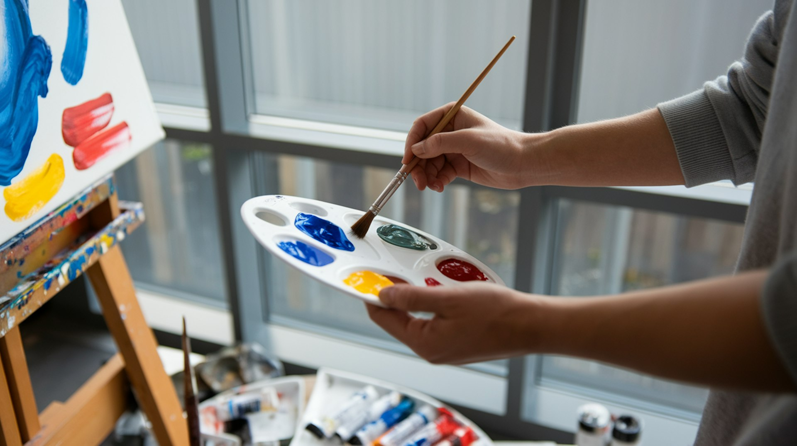

## 🌟 영어 표현 - dabble in

안녕하세요, 여러분! 👋 오늘은 **'조금 해보다', '맛보다', '찍먹하다'** 라는 의미를 가진 **"dabble in"** 표현에 대해 알아볼게요.

"dabble in"은 어떤 활동이나 취미를 **깊이 있게 하는 것이 아니라, 가볍게 시도해보거나 경험해보는 것**을 의미해요. 특히 새로운 취미나 관심사를 시작할 때 자주 사용되는 표현이죠! 🎨

이 표현은 약간의 **가벼움이나 비전문성**을 내포하고 있어요. 예를 들어, "I dabble in photography on weekends." (주말에 사진 촬영을 조금씩 해보고 있어요.) 이렇게 말하면 전문 사진작가가 아니라 취미로 즐기는 수준이라는 뉘앙스가 전달돼요.

<ins class="adsbygoogle"
     style="display:block"
     data-ad-client="ca-pub-1465612013356152"
     data-ad-slot="2106896038"
     data-ad-format="auto"
     data-full-width-responsive="true"></ins>

## 📖 예문

"주말마다 그림 그리기를 조금씩 해보고 있어요."

"I dabble in painting on weekends."

"요즘 주식 투자를 살짝 시도해보고 있어요."

"I've been dabbling in stock trading lately."

자, 이제 "dabble in"을 활용해서 더 많은 문장들을 만들어봅시다. 꼭 소리내어 말하면서 연습해보세요! 🎯

## 💬 연습해보기

대학 때 사진을 취미로 조금 해봤는데, 진지하게 하진 않았어.

I used to dabble in photography during college, but I never took it seriously.

우리 여동생은 이것저것 다 찍먹해봐 - 지난달엔 도자기였다가 이번엔 정원 가꾸기야.

My sister dabbles in everything - pottery last month, gardening this month.

A: "전문적으로 그림 그리세요?" B: "아니요, 시간 날 때 가끔 그리는 정도예요."

A: "Are you a professional painter?" B: "No, I just dabble in it when I have time."

웹 디자인을 잠깐 찍먹해봤는데, 내 적성은 아니더라고.

I dabbled in web design for a bit, but it wasn't really for me.

전문가는 아니고 - 가끔 프랑스 요리를 해보는 정도예요.

I'm no expert - I just dabble in French cooking occasionally.

내 동생이 요즘 목공예를 시작했어. 나한테 멋진 선반도 만들어줬어.

My brother's been dabbling in woodworking lately. He made me a beautiful shelf.

그녀는 한 가지에 집중하기보다는 이것저것 너무 많이 손대고 있어.

She's dabbling in too many things <a href="/blog/in-english/169.instead-of/">instead of</a> focusing on one path.

## 🤝 함께 알아두면 좋은 표현들

### specialize in

'specialize in'은 **"~을 전문으로 하다"** 라는 뜻이에요. **특정 분야나 주제에 대해 깊이 있는 지식이나 기술을 갖고 있는 상태**를 나타내요. 전문적인 접근이나 기술을 강조할 때 사용해요.

"After years of training, she [decided to](/blog/in-english/062.decide-to/) specialize in pediatric medicine."

"수년간의 훈련 후, 그녀는 소아 의학을 전문으로 하기로 결정했습니다."

### take a back seat

'take a back seat'는 **"뒷전으로 물러나다" 또는 "덜 중요한 역할을 하다"** 라는 의미예요. **어떤 일에 대해 적극적으로 참여하지 않고, 상대적으로 덜 중요한 위치를 차지**할 때 사용해요.

"After the promotion, she [decided to](/blog/in-english/062.decide-to/) take a back seat and let her team take the lead."

"승진한 후, 그녀는 뒷전으로 물러나 팀이 주도하게 하기로 결정했습니다."

---

오늘은 **'조금 해보다', '맛보다'** 의 의미를 전달하는 **'dabble in'** 에 대해 배워봤어요. 새로운 취미나 활동을 시작할 때 유용하게 쓸 수 있는 표현이죠? 여러분의 일상 대화에서 자연스럽게 사용해보세요! 😊 화이팅! 💪
