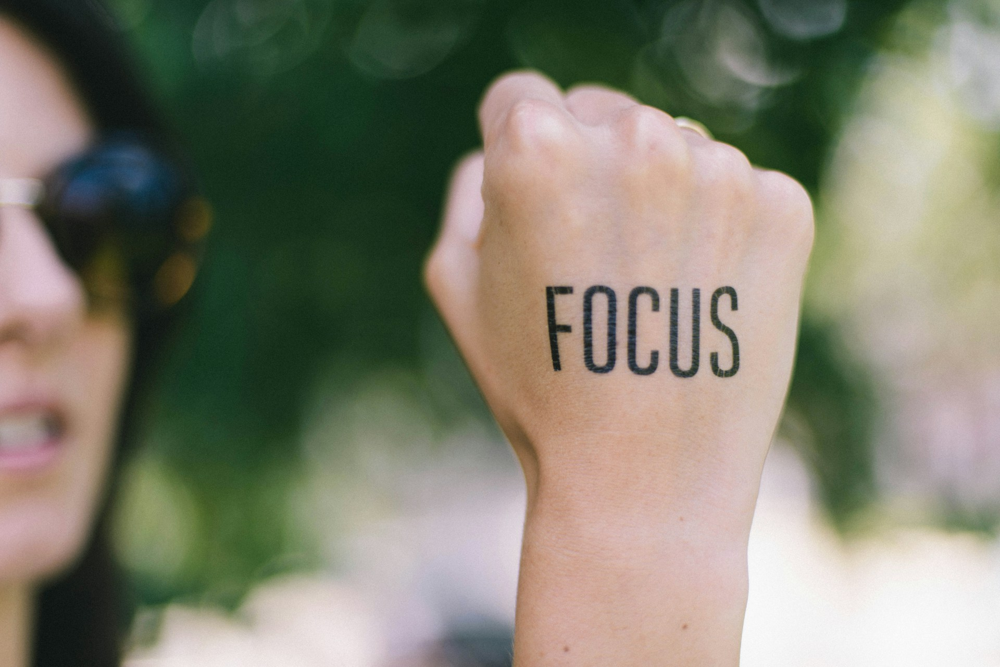

## 🌟 영어 표현 - focus on

안녕하세요, 여러분! 👋 오늘은 영어로 **'집중하다', '주목하다'** 라는 의미를 나타내는 **"focus on"** 표현에 대해 알아볼게요.

"focus on"은 일상생활에서 정말 많이 사용되는 표현이에요. **주로 어떤 일이나 대상에 집중하거나 주의를 기울일 때 사용하죠. 특히 공부나 업무, 목표 달성과 관련된 상황**에서 자주 쓰여요. 🎯

예를 들어, 시험 공부를 할 때 이렇게 말할 수 있어요. "I need to focus on my studies." (공부에 집중해야 해요.) 업무 상황에서도 "Let's focus on this project first." (이 프로젝트에 먼저 집중하죠.) 이렇게 자연스럽게 사용할 수 있답니다!

"focus on"은 **목표나 우선순위를 강조** 할 때도 많이 써요. 🎨 예를 들면, "I want to focus on improving my English." (영어 실력 향상에 집중하고 싶어요.) 이렇게 말하면 특정 목표에 대한 강한 의지를 표현할 수 있어요.

## 📖 예문

"요즘 뭐에 집중하고 있어요?"

"What are you focusing on these days?"

"건강관리에 집중하고 있어요"

"I'm focusing on my health."

자, 이제 "focus on"을 사용한 다양한 예문을 살펴볼까요? 꼭 소리내어 말하면서 연습해보세요! 🚀

<!-- engple-horizontal-ad -->

<ins class="adsbygoogle"
     style="display:block"
     data-ad-client="ca-pub-1465612013356152"
     data-ad-slot="2106896038"
     data-ad-format="auto"
     data-full-width-responsive="true"></ins>

## 💬 연습해보기

우리 올해는 돈 모으는 데 집중해야돼.

We should focus on saving money this year.

금요일까지 이 프로젝트 마무리하는 데 집중하자.

Let's focus on getting this project done before Friday.

일에 집중해야 하는데 이런 방해요소들 때문에 미치겠어.

I need to focus on my work, but these <a href="/blog/in-english/190.distraction/">distractions</a> are killing me.

정신이 산만하네! 한 번에 하나씩 집중해서 하는 게 어때?

You're all over the place! <a href="/blog/in-english/117.try-to/">Try to</a> focus on one thing at a time.

배고프면 아무것도 집중이 안 돼.

I can't focus on anything when I'm hungry.

코치님이 오늘 연습은 수비에 집중하자고 하셨어.

The coach wants us to focus on defense during today's practice.

잘못된 점에 집중하기 보다는 대신에 해결책을 찾는 데 집중하자.

Let's not focus on what went wrong. <a href="/blog/in-english/169.instead-of/">Instead</a>, let's find solutions.

애들이 게임하고 나면 숙제에 집중하기 힘들어하더라.

The kids find it hard to focus on their homework after playing video games.

잠깐, 본론으로 돌아갈까?

Could we focus on the main issue here?

## 🤝 함께 알아두면 좋은 표현들

### concentrate on

'concentrate on'은 **"집중하다" 또는 "전념하다"** 라는 뜻이에요. 어떤 특정한 일이나 주제에 **정신을 쏟고 몰입하는 상태**를 나타내며, 특히 주의가 분산되지 않도록 하는 것을 강조할 때 많이 사용해요.

"I need to concentrate on my studies if I want to pass the exam."

"시험에 합격하고 싶다면, 공부에 집중해야 해요."

### pay attention to

'pay attention to'는 **"주의를 기울이다" 또는 "관심을 가지다"** 라는 의미예요. 어떤 것에 대한 **관심이나 주의를 명확히 나타내는 표현**으로, 특정한 정보나 세부 사항에 대한 집중을 강조할 때 사용해요.

"You should pay attention to the instructions before starting the project."

"프로젝트를 시작하기 전에 지침에 주의를 기울여야 합니다."

---

오늘은 **'집중하다', '주목하다'** 의 의미를 전달하는 **'focus on'** 에 대해 배워봤어요. 정말 유용한 표현이죠? 일상 대화에서 자주 사용해보세요. **목표 설정, 우선순위 지정, 또는 집중이 필요한 상황**에서 이 표현을 쓰면 여러분의 영어가 한층 더 자연스러워질 거예요! 😉

여러분도 오늘 배운 "focus on"을 사용해서 여러분의 목표를 표현해보는 건 어떨까요? 연습이 실력을 만든답니다! 화이팅! 💪
