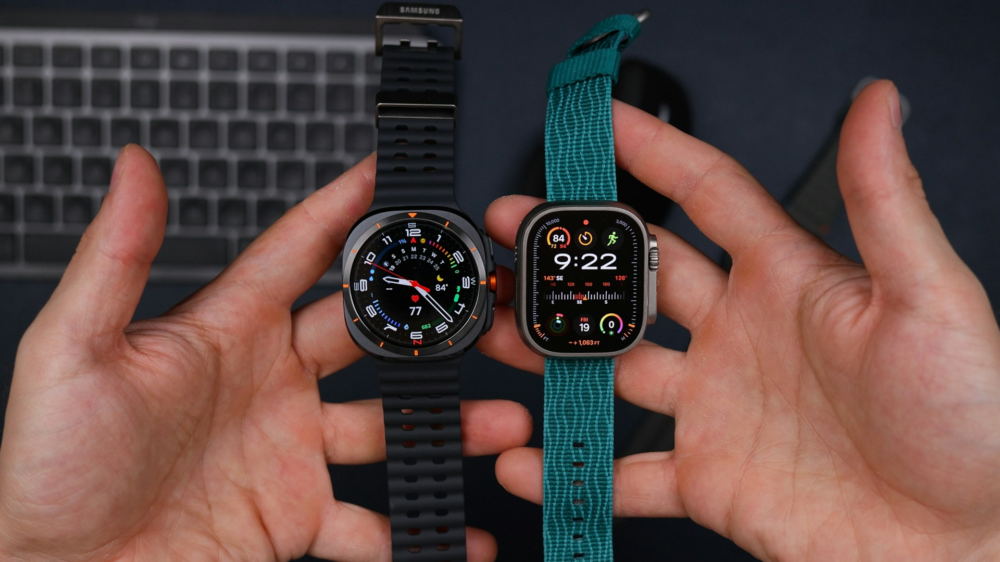

## 🌟 영어 표현 - in comparison

안녕하세요, 여러분! 👋 오늘은 영어로 **'~와 비교하면', '비교했을 때'** 를 의미하는 **"in comparison"** 표현에 대해 알아볼게요.

"in comparison"은 **두 가지 이상의 것을 비교할 때 사용하는 표현**이에요. 특히 차이점을 강조하고 싶을 때 많이 사용하죠! 🤔

이 표현은 보통 "in comparison to" 또는 "in comparison with"의 형태로도 사용돼요. **'~와 비교했을 때'** 라는 뜻으로, 문장 앞이나 뒤에 자유롭게 넣을 수 있답니다! ✨

예를 들어, "This summer is much hotter in comparison to last year." (작년과 비교하면 올해 여름이 훨씬 더워요.) 이렇게 사용할 수 있어요.

또는 간단히 "in comparison"만으로도 충분해요. "The new phone is quite expensive. The old model was cheap in comparison." (새 폰은 꽤 비싸요. 이전 모델은 비교하면 싸죠.) 🤳

<ins class="adsbygoogle"
     style="display:block"
     data-ad-client="ca-pub-1465612013356152"
     data-ad-slot="2106896038"
     data-ad-format="auto"
     data-full-width-responsive="true"></ins>

## 📖 예문

"지난달과 비교하면 이번 달 매출이 더 좋아요."

"This month's sales are better in comparison to last month."

"그와 비교하면 나는 아직 초보예요."

"I'm still a beginner in comparison to him."

자, 이제 "in comparison"을 활용한 예문들을 살펴봤어요. 꼭 소리내어 따라해보세요! 🎯

## 💬 연습해보기

새 아이폰은 작년 모델에 비해 꽤 비쌉니다.

The new iPhone is quite expensive in comparison to last year's model.

내 여동생은 정말 키가 커요. 저는 비교하면 작아 보여요!

My sister's really tall. I look tiny in comparison!

도쿄 지하철은 뉴욕에 비해 정말 깨끗하네요.

Tokyo's subway is super clean in comparison to New York's.

여기 겨울은 캐나다에서 겪었던 것보다 훨씬 온화해요.

The winter here is mild in comparison to what I experienced in Canada.

그 새 식당의 가격은 시내 다른 곳들에 비해 정말 합리적이에요.

That new restaurant's prices are reasonable in comparison to other places downtown.

그의 새 여자친구는 지난 여자친구에 비해 괜찮아 보이네요.

His new girlfriend seems nice in comparison to the last one.

그 영화는 리뷰에 비해 실제로 좋았어요.

The movie was actually good in comparison to what the reviews said.

## 🤝 함께 알아두면 좋은 표현들

### on the other hand

'on the other hand'은 **"다른 한편으로는"** 이라는 뜻이에요. 서로 다른 두 가지 관점을 제시할 때 사용하며, **대조되는 의견이나 사실을 나타낼 때** 자주 사용됩니다. 대화나 글에서 균형 잡힌 시각을 제공할 때 유용해요.

"Some people [prefer](/blog/in-english/191.prefer/) city life for convenience; on the other hand, others enjoy the peace of the countryside."

"어떤 사람들은 편리함 때문에 도시 생활을 선호하지만, 다른 한편으로는 시골의 평온함을 즐깁니다."

### in contrast

'in contrast'는 **"대조적으로"** 라는 의미예요. 두 가지 이상의 요소를 비교하면서 **서로 다른 점을 강조할 때** 사용합니다. 주로 논리적인 전개나 비교를 통해 차이점을 명확히 할 때 많이 쓰여요.

"The climate in the south is warm and sunny; in contrast, the north experiences harsh winters."

"남부의 기후는 따뜻하고 맑지만, 대조적으로 북부는 혹독한 겨울을 겪습니다."

### unlike

'unlike'는 **"달리" 또는 "반대로"** 라는 의미예요. 두 가지 요소의 차이를 강조할 때 사용하며, **특정한 차이점을 부각시키고자 할 때** 자주 쓰입니다. 주로 두 가지를 비교하여 서로 다른 점을 나타낼 때 사용해요.

"Unlike his brother, who loves sports, he [prefers](/blog/in-english/191.prefer/) reading books."

"스포츠를 좋아하는 그의 형과 달리, 그는 책 읽기를 선호합니다."

---

오늘은 **'비교하다', '~와 비교했을 때'** 를 표현하는 **'in comparison'** 에 대해 배워봤어요. 이제 두 가지 이상의 것을 비교할 때 자연스럽게 사용할 수 있겠죠? 여러분의 영어 실력이 한 단계 업그레이드될 거예요! 😊

다음에 또 유용한 표현으로 찾아올게요. 그때까지 열심히 연습해보세요! 화이팅! 💪
