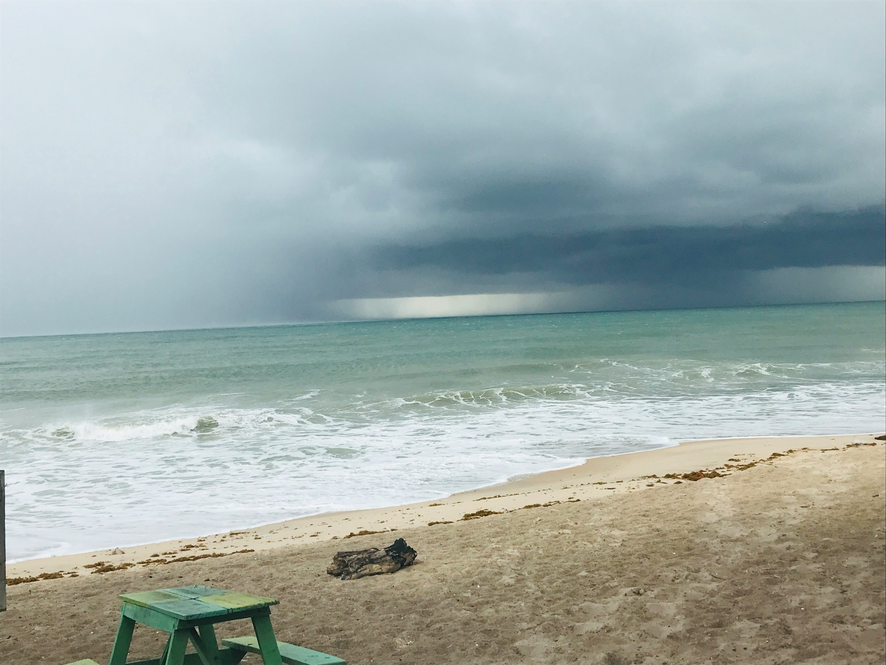

## 🌟 영어 표현 - likely to

안녕하세요 👋 '**~할 가능성이 높다**', '**~할 것 같다**'라는 의미를 가지는 영어 표현을 아시나요? 바로 '**likely to**'라는 표현이에요! 이 표현은 어떤 일이 일어날 가능성이 높다는 것을 의미해요. **확실하지는 않지만, 그 일의 발생 가능성이 크다는 뉘앙스를 가지고 있어요.** 그래서 긍정적인 의미로도 사용될 수 있고, 부정적인 상황에도 적용될 수 있답니다! 🌟

예를 들어, "It's likely to rain tomorrow." (내일 비가 올 가능성이 높아요.)라고 말할 수 있어요. 이렇게 말하면 상대방에게 내일 비가 올 가능성이 크다는 정보를 주는 거죠.

그럼 "**likely to**"를 사용한 예문들을 조금 더 살펴볼게요. 여러분도 상황을 떠올리면서 한 번 소리 내어 읽어보세요!

## 📖 예문

"그는 시험에 합격할 가능성이 높아요."

"He's likely to pass the exam."

"그 사람 또 늦을 것 같아."

"He's likely to be late again."

## 💬 연습해보기

이 영화 오스카 탈 가능성이 높아.

This movie is likely to win an Oscar.

오늘 밤 파티에 못 갈 가능성이 높아.

I'm not likely to <a href="/blog/in-english/244.make-it/">make it</a> to the party tonight

주택 시장이 곧 무너질 것 같아.

The housing market is likely to crash soon.

이 신발은 몇 달 이상 못 갈 것 같아.

These shoes aren't likely to last more than a few months.

날씨는 내일 오후쯤 맑아질 것 같아.

The weather's likely to clear up by tomorrow afternoon.

폭풍우 때문에 비행기가 지연될 것 같아.

The flight's likely to be delayed because of the storm.

그녀는 그가 한 일 때문에 용서하지 않을 것 같아.

She's not likely to forgive him after what he did.

소포는 다음 주쯤 도착할 가능성이 높아.

The package is likely to arrive sometime next week.

올해 크리스마스에 부모님이 방문하실 가능성이 높아.

My parents are likely to visit for Christmas this year.

그 스타트업은 전략을 바꾸지 않으면 실패할 것 같아.

That startup is likely to fail if they don't change their strategy.

## 🤝 함께 알아두면 좋은 표현들

### bound to

'[bound to](/blog/in-english/212.bound-to/)'는 "**~할 가능성이 높은**" 또는 "**~할 운명인**"이라는 의미예요. 어떤 일이 반드시 일어날 것이라는 강한 확신을 나타내는 표현으로, 긍정적인 상황에서 자주 사용돼요.

"With her talent and hard work, she is bound to succeed in her career."

"그녀의 재능과 노력으로 봤을 때, 커리어에서 무조건 성공할거에요"

### unlikely to

'[unlikely to](/blog/가능성이-거의-없어-영어표현/)'는 "**~할 가능성이 낮은**"이라는 의미예요. 어떤 일이 일어날 가능성이 적다는 것을 나타내며, 주로 부정적인 결과나 상황에 대해 이야기할 때 많이 사용돼요.

"It is unlikely to rain tomorrow according to the weather forecast."

"일기예보에 따르면 내일 비가 올 가능성이 낮아요."

### inclined to

'inclined to'는 "**~하는 경향이 있다**"라는 뜻이에요. 어떤 특정한 행동이나 생각을 할 가능성이 높다는 의미로, 주로 개인의 성향이나 기호를 이야기할 때 사용돼요.

"She is inclined to take risks when it comes to her career choices."

"그녀는 커리어 선택에 있어서 위험을 감수하는 경향이 있어요."

---

오늘은 '**~할 가능성이 높다**'라는 의미를 전달하는 '**likely to**'에 대해 배워봤어요. 다음번에 누군가 어떤 일의 가능성에 대해 이야기할 때, 이 표현을 한번 활용해 보세요. 😊

오늘 배운 표현과 예문들, 최소 3번씩 소리 내어 읽어보세요. 다음에도 더 재밌고 유익한 표현으로 찾아올게요!
