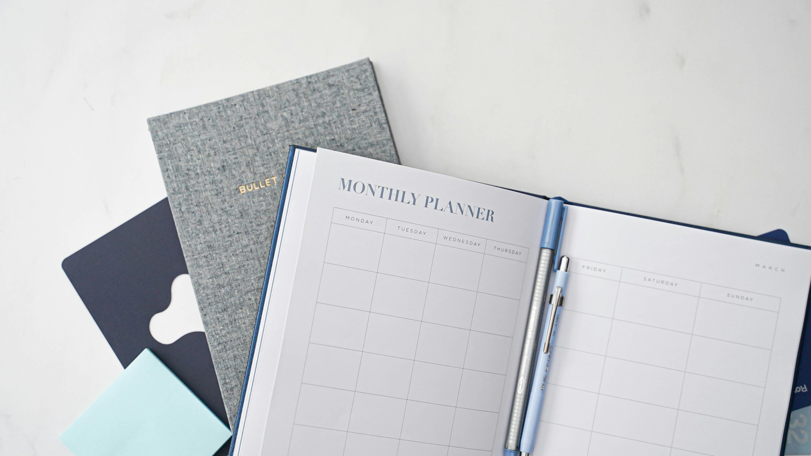

## 🌟 영어 표현 - learn

안녕하세요 👋 '**배우다**'라는 의미를 가지는 영어 표현, '**learn**'에 대해 알아볼까요? 이 표현은 **지식이나 기술, 정보를 습득하다**라는 의미를 가지고 있어요. 대개 긍정적인 뉘앙스를 가지고 있으며, 새로운 것을 받아들이고 성장하는 느낌을 줘요! 🌱

예를 들어, "I want to learn a new language." (나는 새로운 언어를 배우고 싶어.)라고 말할 수 있어요. 이렇게 말하면 새로운 언어에 대한 호기심과 배우고자 하는 열망을 표현하는 거죠.

<!-- engple-horizontal-ad -->

<ins class="adsbygoogle"
     style="display:block"
     data-ad-client="ca-pub-1465612013356152"
     data-ad-slot="2106896038"
     data-ad-format="auto"
     data-full-width-responsive="true"></ins>

그럼 "**learn**"을 사용한 예문들을 조금 더 살펴볼게요. 여러분도 상황을 떠올리면서 한 번 소리 내어 읽어보세요!

## 📖 예문

1. "나는 요가를 배우고 싶어."

   "I want to learn yoga."

2. "이번 여름에 피아노를 배우기로 했어."

   "I'm going to learn piano this summer."

## 💬 연습해보기

나는 여섯 살 때 자전거 타는 법을 배웠어요.

I learned to ride a bike when I was six.

그녀는 멕시코 여행을 위해 스페인어를 배우고 있어요.

She's learning Spanish for her <a href="/blog/in-english/250.upcoming/">upcoming</a> trip to Mexico.

그는 운전 배우고 있으니까 좀 인내심을 가져줘요.

He's learning to drive, so be patient with him.

우리 아이들은 이번 주에 학교에서 공룡에 대해 배우고 있어요.

My kids are learning about dinosaurs at school this week.

어디서 그렇게 요리하는 법을 배웠어요?

Where did you learn to cook like that?

주차 딱지를 받고 나서 교훈을 얻었어요.

I learned my lesson after getting that parking ticket.

농담을 받아들이는 법을 배워야 해요, 친구.

You gotta learn to take a joke, man.

나는 제대로 수영하는 법을 배운 적이 없어요.

I never learned how to swim properly.

그들은 온라인 강좌를 통해 코딩을 배우고 있어요.

They're learning to code through an online course.

## 🤝 함께 알아두면 좋은 표현들

### pick up

'[pick up](/blog/in-english/178.pick-up)'은 "**습득하다**" 또는 "**배우다**"라는 의미로 사용돼요. 이 표현은 **비공식적이고 자연스러운 방식으로 무언가를 배우는 과정**을 나타내며, 대개 일상적인 상황에서 자주 사용돼요.

"I [managed to](/blog/in-english/175.manage-to/) pick up some Spanish while traveling in Mexico."

"나는 멕시코 여행 중에 스페인어를 좀 습득했어요."

### grasp

'grasp'는 "**이해하다**"라는 뜻이에요. 이 표현은 **어려운 개념이나 정보를 확실히 이해하는 상태**를 강조해요. 보통 학습이나 교육의 맥락에서 많이 사용돼요.

"It [took me a while](/blog/in-english/010.take-a-while/) to grasp the concept, but now it [makes perfect sense](/blog/in-english/068.make-sense/)."

"그 개념을 이해하는 데 시간이 좀 걸렸지만, 이제는 완벽하게 이해해요."

### master

'master'는 "**숙달하다**"라는 의미예요. 이 표현은 **어떤 기술이나 지식을 완벽하게 익히는 과정**을 나타내며, 보통 긴 시간 동안의 노력이 필요할 때 사용돼요.

"After years of [practice](/blog/in-english/247.practice/), she [finally](/blog/in-english/182.finally/) mastered the piano."

"수년간의 연습 끝에 그녀는 드디어 피아노에 숙달했어요."

---

오늘은 '**배우다**'라는 의미를 전달하는 '**learn**'에 대해 배워봤어요. 다음번에 누군가 새로운 것을 배우려는 모습을 보인다면, 이 표현을 한번 활용해 보세요. 그리고 여러분도 배움의 기회를 놓치지 않도록 해보세요! 😊

오늘 배운 표현과 예문들, 최소 3번씩 소리 내어 읽어보세요. 다음에도 더 재밌고 유익한 표현으로 찾아올게요!
